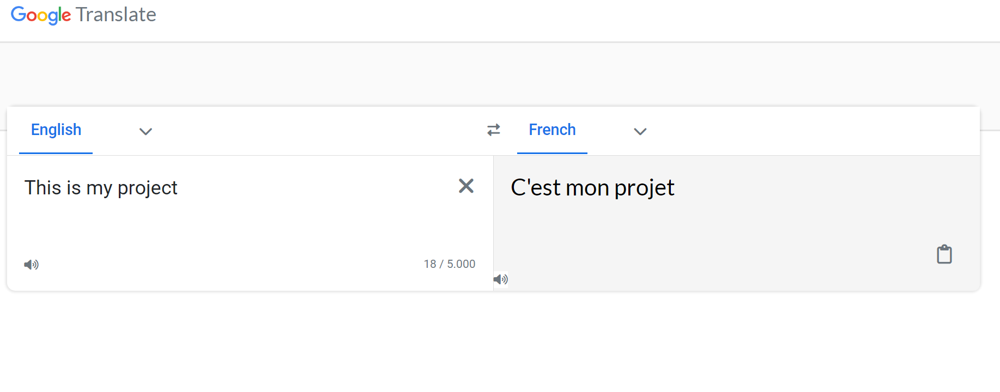
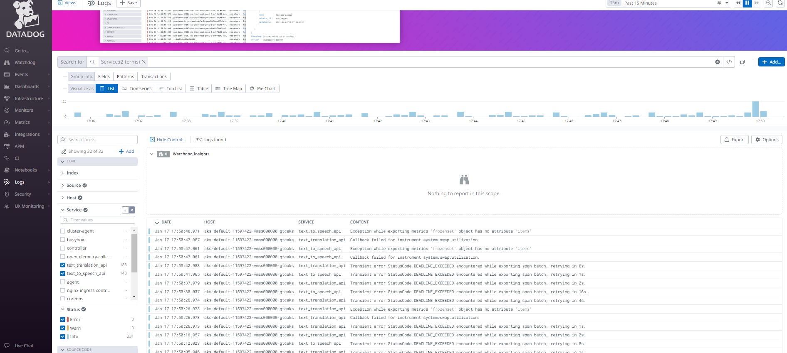
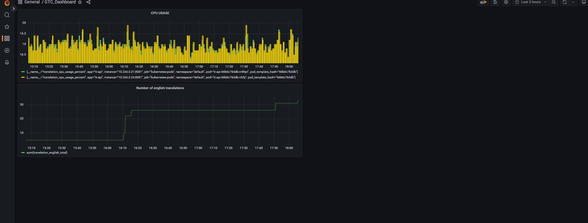
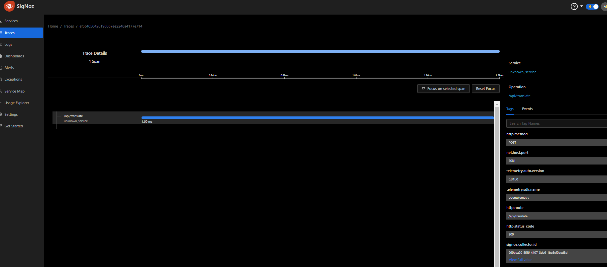
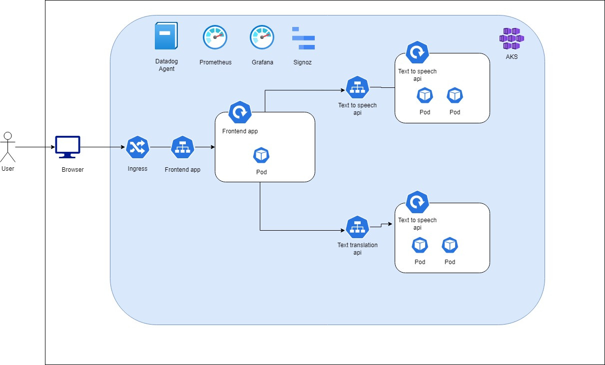
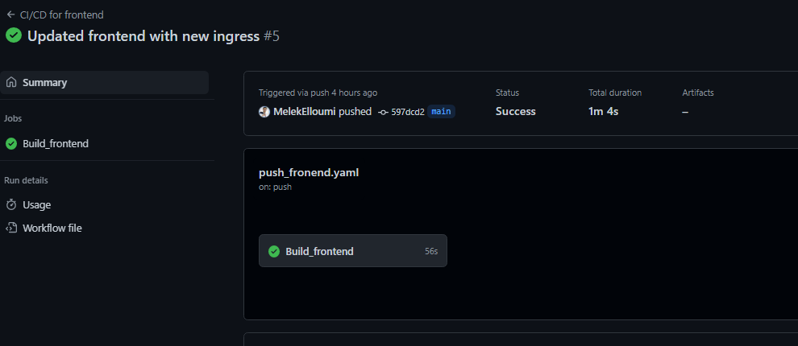

# Google Translate Clone (DevOps Project)

## 1-Application

* This project is part of GL5 DevOps Lab. We are meant to create a distributed application, 
then use it with other tools in order to understand different DevOps concepts.

* Google Translate Clone is what its name implies. It consists of a google-like frontend made with react
and 2 microservices made with flask, one for text translation and language detection and the other for
text to speech.
* The front was based on [TheScientist01's](https://github.com/TheScientist01/GoogleTranslateClone) work.
* Text translation api uses the googletrans package.
* Text to speech api uses the gtts package (google text to speech)

You can access the app [here](http://20.23.138.64/)



### ToDo DevOps

- [ ] Observability
  - [x] Metrics (Prometheus + Grafana)
    - [x] General Metrics
      - [x] Total number of requests metric
      - [x] Success labels
      - [x] Endpoint label
    - [x] Business logic metric
      - [x] Number of english translations
  - [x] Logs (Datadog)
    - [x] Request_id
    - [x] Client_ip
  - [ ] Trace (Signoz)
    - [x] Generate traces for handlers
    - [ ] Request_id and client_ip
  - [ ] Helm
    - [x] Helm chart
    - [x] Values.yaml
    - [x] Labels addtion
    - [ ] Env variables for open telemetry
- [ ] Deployment (Kubernetes)
  - [x] Microservices
  - [ ] Deployment strategy
  - [x] Configurations and secrets
  - [ ] Network architecture / Network policies
  - [x] 1 Endpoint exposed publicly
- [ ] Automation
  - [x] Infrastructure provisioning (Terraform)
  - [ ] Initialization for workloads
  - [ ] Multi-environment setup
  - [x] Microstacks
  - [x] Deployment

## 2-Observability
### 1-Logging
* I used python's logging package to add labels to the logs such as the client ip and a unique generated request
id.
* The logs are streamed to stdout and datadog agent will take care of collecting every log.
* We can then filter through the logs based on the labels we defined.

### 2-Metrics
* I used prometheuse client to save multiple metrics in both of the apis.
* I used generic metrics to keep track of total number of requests (successful and failed) with a Counter, the cpu and memory usage
with Gauges and the response time of requests with a Histogram.
* I used counter to count the number of english translations. This can be automized to include all the languages
and generate good data insights on people needs.
* The metrics are sent to the /metrics endpoint which prometheus collects periodically.
* Grafana uses it as a datasource to create Dashboards.

### 3-Traces
* I used signoz to track the traces of the requests through the apis endpoints.

## 3-Deployment
* I used Kubernetes to deploy the 3 image containers of my app (frontend, text translation api and text to speech api) 
on Azure Kubernetes Service. 
* I used the default namespace and multiple replicas for the microservices.
* The app is exposed externally with ingress.
* I also deployed the needed monitoring services (Datadog, Prometheus, Grafana, Signoz).
### 1-Architecture

### 2-Deployment Strategy
I will use the A/B testing deployment strategy since it fits my needs:
* Zero downtime when deploying.
* Ability to test on a real traffic.
* Targetted Users: the app will be used by users around the globe. As we improve language translation models, we want 
to test them per zone to make sure it is translating properly.

## 4-Automation
### 1-CI pipeline
* I configured github actions workflows to automate the build step of CI.
* Each Workflow build a docker image and push it to my [DockerHub](https://hub.docker.com/u/melekelloumi) account when it detects pushes on each app.

### 2-Microstacks
I used Terraform to automate the infrastructure provisioning. The terraform backend is stored on a container in 
Azure Storage.
The goal of microstacks is to create a well isolated and maintainable infrastructure layers.

1- AKS Stack: This stack takes care of creating a resource group and  AKS on Azure.

2- Infrastucture Stack: This stack takes care of provisioning the kubernetes cluster for the entire project.

3- Ingress Stack: This stack takes care of deploying ingress to the cluster.

4- Observability Stack: This stack takes care of installing our monitoring tools using the kubernetes provider and helm provider for these tools (prometheus, grafana, datadog , signoz).

### 3-Deployment
* To automate the deployment, I used helm to define the clusters and Kubernetes Deployments and to bring the external
observability services.
* You can find the Helm chart and all the configurations [here](https://github.com/MelekElloumi/google-translate-clone/tree/main/Infrastructure)

* Values.helm: 
```
replicaCountFront: 1
replicaCountApi: 2

image:
  tag: latest
  ttapi: melekelloumi/text_translation_api:latest
  ttsapi: melekelloumi/text_to_speech_api:latest
  frontend: melekelloumi/gtc_frontend:latest

http:
  ttport: 8081
  ttsport: 8082
  frontendport: 80
  frontendporttarget: 3000

labels:
  app: gtc-frontend
  env: production
```
    